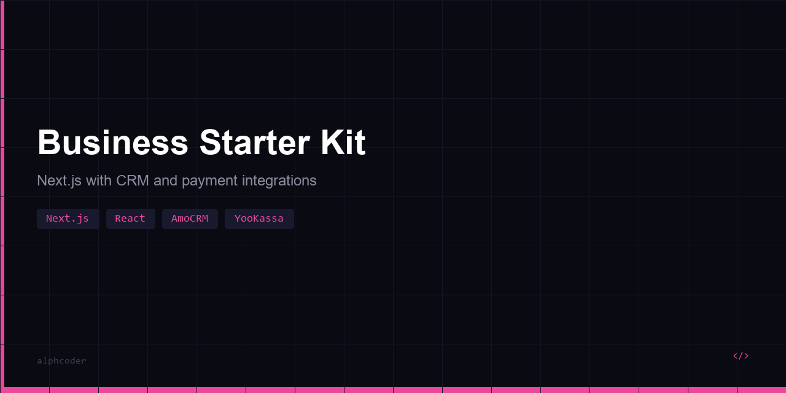

# 🚀 Business Starter Kit

Шаблон корпоративного сайта / лендинга для бизнеса — **Next.js** + **React** + **Tailwind CSS** + интеграции (AmoCRM, ЮKassa, Telegram).

Готовый сайт с формой заявки, отправкой лидов в CRM, Telegram-уведомлениями и приёмом оплаты.

## Архитектура

```
┌──────────────────────────┐
│  Next.js (React + SSR)   │
│  ├─ Hero, Services       │  Компоненты (Tailwind)
│  ├─ ContactForm          │  react-hook-form + zod
│  └─ pages/api/           │  API Routes
│       ├─ lead.ts         │  → AmoCRM + Telegram
│       └─ payment.ts      │  → ЮKassa
└──────────────────────────┘
         │
   ┌─────┼──────────┐
   ▼     ▼          ▼
AmoCRM  Telegram   ЮKassa
API v4  Bot API    Payments
```

## Функционал

- **Лендинг** — Hero, услуги, форма заявки (адаптивный, Tailwind)
- **Форма заявки** — валидация Zod, отправка в AmoCRM + Telegram-уведомление
- **Оплата** — ЮKassa (создание платежа, редирект, webhook)
- **SEO** — мета-теги, SSR, оптимизация скорости
- **API Routes** — серверная логика внутри Next.js (без отдельного бэкенда)

## Интеграции

| Сервис | Что делает |
|--------|-----------|
| AmoCRM API v4 | Создание лида из формы заявки |
| Telegram Bot API | Уведомление админу о новой заявке |
| ЮKassa | Приём оплаты, создание платежа |

## Стек

| Компонент | Технология |
|-----------|------------|
| Framework | Next.js 14, React 18 |
| Стилизация | Tailwind CSS |
| Формы | react-hook-form + Zod |
| Интеграции | AmoCRM, Telegram, ЮKassa |
| Типизация | TypeScript |

## Быстрый старт

```bash
git clone https://github.com/alphcoder/business-starter-kit.git
cd business-starter-kit
npm install
cp .env.example .env
npm run dev
```

## Структура

```
business-starter-kit/
├── src/
│   ├── pages/
│   │   ├── index.tsx          # Главная (Hero + Services + Form)
│   │   └── api/
│   │       ├── lead.ts        # AmoCRM + Telegram
│   │       └── payment.ts     # ЮKassa
│   ├── components/
│   │   ├── Hero.tsx
│   │   ├── Services.tsx
│   │   └── ContactForm.tsx    # Форма с валидацией
│   └── lib/
│       └── api.ts             # AmoCRM, Telegram, ЮKassa клиенты
├── tailwind.config.js
├── package.json
└── .env.example
```

## Лицензия

MIT
